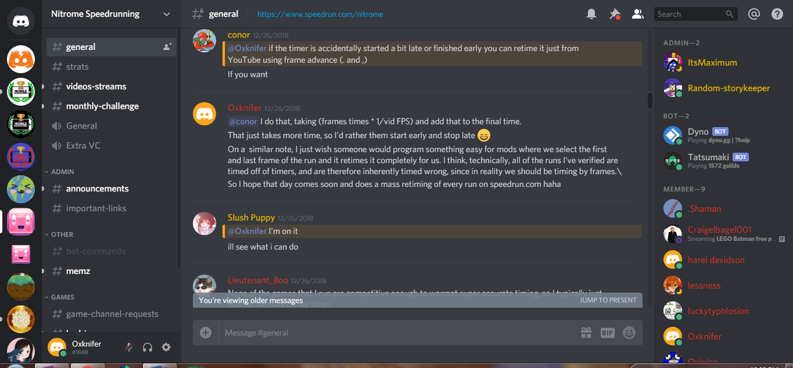

# Speedrun Retimer
A mobile-friendly program to determine the time between start and end points of a YouTube video down to the frame. The tool was originally created to help moderators retime speedruns on [speedrun.com](https://www.speedrun.com).

## History

In December of 2018, the idea for this tool was mentioned in the [Nitrome Speedrunning Discord](https://discord.gg/tszYjDJ) by [Oxknifer (me)](https://www.speedrun.com/user/Oxknifer).

The first version of this tool, created in December 0f 2018, is [Slush Puppy's Retime Tool (SPRT)](https://github.com/Slush0Puppy/retime) by [SlushPuppy](https://www.speedrun.com/user/SlushPuppy).
Languages: Python

The second version, created in January of 2019, is [yt-frame-timer](https://slashinfty.github.io/yt-frame-timer/) by [dadinfinitum](https://www.speedrun.com/user/dadinfinitum).
Languages: JavaScript, HTML

Meanwhile, the [mk8dx-speedrun-timer](https://mk8dx-speedrun-timer.azurewebsites.net/) was created by [VikeMK](https://www.speedrun.com/user/VikeMK) for the Mario Kart speedrunning community.
Languages: JavaScript, HTML

The third version of [the retimer](https://speedrun-timer.itsmeme11.repl.co/) is by [AmineCrafter101](https://www.speedrun.com/user/AmineCrafter101). Created in April of 2021, it combined the frame calculations of yt-frame-retimer with the embedded YouTube player of mk8dx-speedrun-timer.
Languages: JavaScript, HTML

The fourth version of [the retimer](https://zromick.github.io/speedrun-retimer/) is by [Oxknifer (me)](https://www.speedrun.com/user/Oxknifer) and is created in TypeScript/React.
Languages: TypeScript, React

## Legacy Contributors
* [Oxknifer](https://www.speedrun.com/user/Oxknifer)
* [SlushPuppy](https://www.speedrun.com/user/SlushPuppy)
* [dadinfinitum](https://www.speedrun.com/user/dadinfinitum)
* [AmineCrafter101](https://www.speedrun.com/user/AmineCrafter101)

Interested in contributing? [Join the Code Runners Discord Server!](https://discord.gg/CrGnuWw)